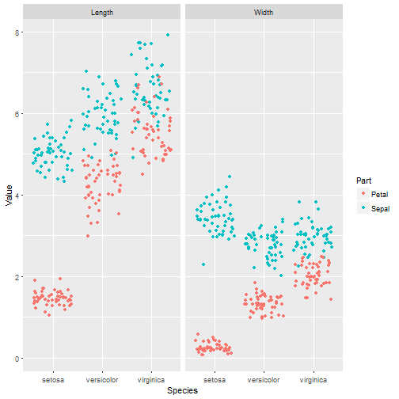

Pitch Presentation - Shiny App Project for DDP Course by John Hopkins and Coursera
========================================================
author: Igor Hut
date: 13-Dec-2016
autosize: true


Overview
========================================================
left:70%
- This app enables simple graphical exploratory analysis of the famous `iris` dataset
- It can be used for educational and demonstrational purposes
- It useses the `ggplot2` system for plotting 
- The `iris` dataset is converted into the "long tidy" format by deployment of `dplyr` and `tidyr` packages
- Future plans - including exploratory analysis of "wide tidy" format, correlation plots, linear regression...

***


Dataset format conversion
========================================================


```r
library(dplyr)
library(tidyr)
library(ggplot2)

iris_l <-  gather(iris, Dimension, Value, -Species) %>% separate(Dimension, c("Part", "Measure"))
iris_l$Part <- as.factor(iris_l$Part)
str(iris_l)
```

```
'data.frame':	600 obs. of  4 variables:
 $ Species: Factor w/ 3 levels "setosa","versicolor",..: 1 1 1 1 1 1 1 1 1 1 ...
 $ Part   : Factor w/ 2 levels "Petal","Sepal": 2 2 2 2 2 2 2 2 2 2 ...
 $ Measure: chr  "Length" "Length" "Length" "Length" ...
 $ Value  : num  5.1 4.9 4.7 4.6 5 5.4 4.6 5 4.4 4.9 ...
```

Example of a plot that can be obtained 
========================================================

```r
ggplot(iris_l, aes(x = Species, y = Value, col = Part)) +
  geom_jitter() +
  facet_grid(.~ Measure)
```
***



More info
========================================================

- The app code and accompanying documentation can be found at <https://github.com/IgorHut/DDP_Shiny_App>

## Thanks!


